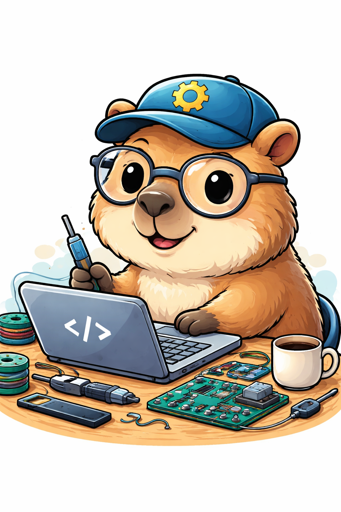

# Team The League Of Super Acquaintances

## 🎨 Brand Identity
- **Theme:** [e.g. AI + Gaming / Minimalist / Cyberpunk]
- **Colors:** [e.g. #000000, #00FFAA]
- **Logo:**  

- **Mascot (optional):** [e.g. Robot Cat 🤖🐱]
- **Tagline:** *"[Your slogan here]"*

---

## 🌟 Team Values
- 🤝 Collaboration: We support each other and communicate clearly
- 🚀 Growth: We continuously improve and learn
- 🧠 Accountability: Everyone takes responsibility for their work
- 💡 Creativity: We encourage new ideas and innovation

---

## 📌 Team Goals
- Deliver a high-quality final project
- Maintain clean and readable code
- Communicate effectively through Slack and meetings
- Meet all deadlines on time

---

## 🧑‍💻 Team Members

### 👤 [Name 1]
- **Major:** Computer Science  
- **Role:** [e.g. Frontend Developer]  
- **GitHub:** https://github.com/[username]  
- **About:** Short intro (1–2 sentences)

---

### 👤 [Name 2]
- **Major:**  
- **Role:**  
- **GitHub:**  
- **About:**  

---

### 👤 [Name 3]
- **Major:**  
- **Role:**  
- **GitHub:**  
- **About:**  

---

## 🧩 Roles & Responsibilities
| Role | Member | Responsibility |
|------|--------|---------------|
| Project Manager | [Name] | Coordination, deadlines |
| Frontend | [Name] | UI/UX development |
| Backend | [Name] | Server, APIs |
| QA / Testing | [Name] | Debugging & testing |

---

## 💬 Communication
- **Slack:** [Workspace link or channel name]
- **Meeting Time:** [e.g. Weekly Sunday 7pm]
- **Response Expectation:** Within 24 hours

---

## ⚠️ Conflict Resolution
- Discuss issues openly first  
- If unresolved → team vote  
- If still unresolved → escalate to TA  

---

## 📂 Resources
- 📁 Branding: `/admin/branding`
- 🎥 Team Video: `/admin/videos/teamintro.mp4`
- 📄 README: [link back to repo root]

---

## 🎬 Team Intro Video
*(Will be added here)*
